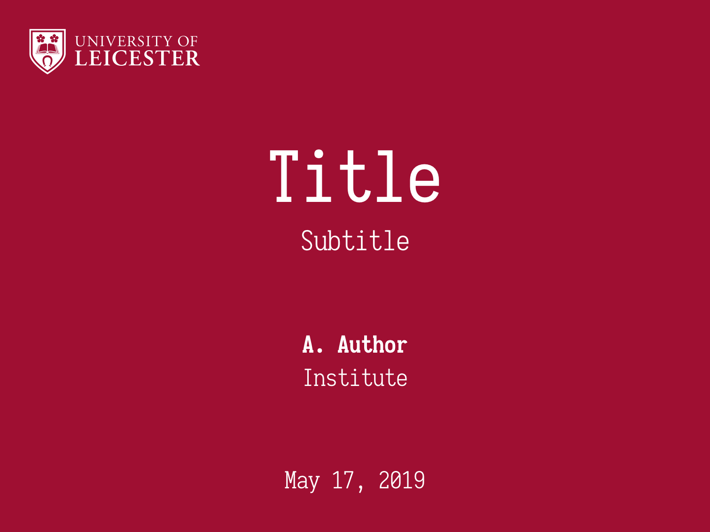
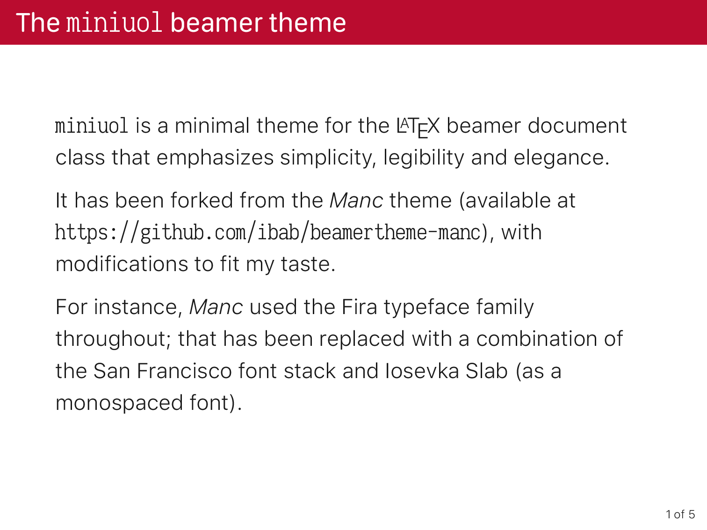

# `minilu` - A Beamer theme

A minimal-looking theme styled to fit most of the [Liberty University](https://www.liberty.edu/marketing/wp-content/uploads/sites/114/2023/01/Branding-Guide-Digital.pdf) brand guidelines.

This is an unofficial theme, and the Liberty University logo is copyright of Liberty University.

This theme has been forked from the [Miniuol](https://github.com/ellessenne/beamertheme-miniuol) Beamer theme, with modifications to fit my taste.

_Miniuol_ takes lots of ideas from:

* [The metropolis theme](https://github.com/matze/mtheme)
* [The tudoposter theme](https://github.com/MaxNoe/tudoposter)

## Requirements

* The document must be compiled using `xelatex`, as the `fontspec` package is required;
* The [Livory](https://fonts.adobe.com/fonts/livory) font family;
* The [Arsenal](https://fonts.google.com/specimen/Arsenal?query=Arsena) font stack.

## Using the theme

You can use this theme by including

```latex
\usebeamertheme{minilu}
```
in the header of your presentation.

The theme can be customized by setting the value of supported options:

```latex
\usebeamertheme[booleanOption, keywordOption = value]{minilu}
```
The currently supported options are:

* `fullfootline`, boolean, activates footline information (short title, short author);
* `background`, keyword, sets a picture as the title background. If this option is not given, the primary color is used to create a solid background;
* `primaryColor`, keyword, the primary color to use for the theme, in HEX format. Defaults to Pantone 282 and Pantone 187;
* `primaryLightColor`, keyword, this is intended to be a lighter version of the primary color (also in HEX format). Defaults to Pantone 284.

## Demos

See [default.pdf](./default.pdf) for the default look of the theme:

[](./default.pdf)

[](./default.pdf)
